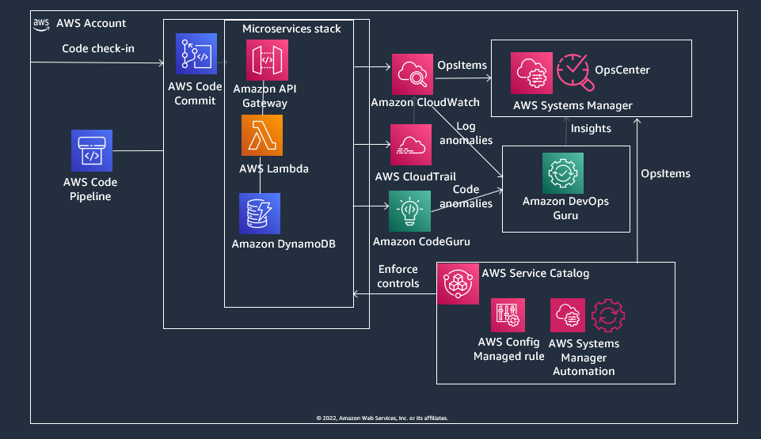

<p align="center">
</p>

# Enable microservices adoption in AWS using Cloud Operations and DevOps services

## Overview

1. Reference solution to enable microservice adoption in AWS using AWS Foundational Services -
	- Automated software delivery for microservices using continuous integration and delivery (CI/CD) pipelines
	- Prescriptive and standardized enforcement of AWS security best practices for microservices
	- Intelligent code scanning and distributed application profiling for microservices
	- Centralized operations dashboard for monitoring and visibility into both microservices code and infrastructure
	- Integrated logging and log anomaly detection for microservices


## Solution Design




## Prerequisites

1. Enable AWS Config in your account as well as optionally in all of your managed accounts in the organization. 
	- Conduct step 1 from the [Automate configuration compliance at scale](https://aws.amazon.com/blogs/mt/automate-configuration-compliance-at-scale-in-aws/) blog post in order to utilize [Systems Manager Quick Setup](https://docs.aws.amazon.com/systems-manager/latest/userguide/systems-manager-quick-setup.html) so you can accomplish it with just a few clicks from your console.
2. Complete these [prerequisites step to enable CloudFormation Stacksets](https://catalog.us-east-1.prod.workshops.aws/workshops/e6a59d62-daa5-4b81-be6f-73f1a81c9bef/en-US/prerequsites) in your AWS environment
2. S3 bucket
	- Create an S3 bucket named *s3-microservices-[AccountID]-[Region]*. You will use this bucket to upload your compliance template as well as use it as a staging template for your devops pipeline
		- Create a folder named *compliance* in the bucket. Upload the [aws-servicecatalog-configremediations.yml](https://gitlab.aws.dev/kmmahaj/microservices-foundationalservices/-/blob/main/cft/compliance/aws-servicecatalog-configremediations.yml) template in this folder.
3. Integrate AWS Cloud9 as a local Git repository with AWS CodeCommit as the remote Git repository
	- 	Complete [Step 1 from this AWS CodeCommit tutorial](https://docs.aws.amazon.com/codecommit/latest/userguide/getting-started-cc.html#getting-started-cc-create-repo) to create a CodeCommit Git repository. Provide a name for your CodeCommit Git repository (for example "microservices").
	- 	From your AWS Cloud9 enviroment, [follow these steps to clone your CodeCommit repository into Cloud9 and use Cloud9 as your local Git repository integrated with a remote CodeCommit repository](https://docs.aws.amazon.com/codecommit/latest/userguide/setting-up-ide-c9.html).
	- In your Cloud9 environment, change folder to the newly created project folder (for e.g. 'microservices') where you have cloned your CodeCommit repo. Download the following files from our [microservices](https://gitlab.aws.dev/kmmahaj/microservices-foundationalservices/-/tree/main/) GitHub repo and upload them to the project folder (for e.g. microservices) of your Cloud9 local Git repository.
		- [cfn-shops-monitoroper-code.yaml](https://gitlab.aws.dev/kmmahaj/microservices-foundationalservices/-/blob/main/cft/devops-aiops/cfn-shops-monitoroper-code.yaml)
		- [buildspec.yml](https://gitlab.aws.dev/kmmahaj/microservices-foundationalservices/-/blob/main/cft/devops-aiops/buildspec.yml)
		- [buildspec-update.yml](https://gitlab.aws.dev/kmmahaj/microservices-foundationalservices/-/blob/main/cft/devops-aiops/buildspec-update.yml)
	- In your *buildspec.yml* file, replace *accountid* and *region* with comma separated AWS Account IDs and regions where you want to deploy your microservices stack
	- Use standard git commands from your Cloud9 cloned repository's root folder (where the buildspec.yml file resides) and check-in your microservices stack to the remote CodeCommit repository
		```sh 
		git add .
		git commit -m "initial commit"
		git push origin *your branch name*
		```
4. AWS Systems Manager Incident Manager requires defining contacts and optionally an escalation plan. [Follow these steps here to define a contact](https://docs.aws.amazon.com/incident-manager/latest/userguide/contacts.html#contacts-define). Once you defined contacts, [follow these steps to define an escalation plan](https://docs.aws.amazon.com/incident-manager/latest/userguide/escalation.html#escalation-create) based on the contact list. Note down the Arn of the Contact details from the console.

## Install

1. **CI/CD for microservices**. Launch the [aws-microservices-codepipeline.yml](https://gitlab.aws.dev/kmmahaj/microservices-foundationalservices/-/blob/main/cft/devops-aiops/aws-microservices-codepipeline.yml) CloudFormation Template. 
	- This template provisions the AWS CodePipeline based DevOps automation with AWS CodeCommit and AWS CodeBuild stages. 
	- The template takes the following parameters:
		-	**RepositoryName**: CodeCommit repository for the Conformance Pack templates i.e. *microservices*.
		-	**BranchName**: Branch in the CodeCommit repository for the microservices stack
		-	**StagingBucket**: Name of the S3 Staging Bucket that stages the microservices stack copied from code commit. In our case this is *s3-microservices-[accountid]-[region]*

2. **AIOps and Centralized Incident Management**. Launch the [aws-microservices-systemsmanager](https://gitlab.aws.dev/kmmahaj/microservices-foundationalservices/-/blob/main/cft/monitoring/aws-microservices-systemsmanager.yml) CloudFormation Template. 
	- This template provisions Systems Manager Incident Response Plans, Systems Manager Incidents and Systems Manager OpsItems for all DevOps Guru insights as well as Config compliance violations. 
	- The template takes the following parameters:
		-	**IncidentPlanContactDetailsArn**: Arn of the Contact details for the Incident Plan. This is the Arn for the contact plan you created in step 4 of the prerequisites.


3. **Prescriptive compliance**. Launch the [aws-servicecatalog-prescriptivecompliance.yml](https://gitlab.aws.dev/kmmahaj/microservices-foundationalservices/-/blob/main/cft/compliance/aws-servicecatalog-prescriptivecompliance.yml) CloudFormation Template. This template:
 	- Provisions custom AWS Systems Manager automation documents to provide automated remediations for AWS Config.
 	- Provisions an AWS Service Catalog Portfolio with an [AWS Config Remediations Product](https://gitlab.aws.dev/kmmahaj/microservices-foundationalservices/-/blob/main/cft/compliance/aws-servicecatalog-configremediations.yml). This Service Catalog product provides automated detection with AWS Config and remediations with AWS Systems Manager. 
 	- The template takes the following parameters:
		-	**S3StagingBucketURL**: URL of the S3 staging bucket from step 2 in the prerequisites section. 

## Validate 

1. **Validate devops**. From the AWS CodePipeline console, validate that the devops code pipeline gets initiated. Validate that the CodeCommit and CodeBuild stages of the pipeline execute successfully.
	- From the API Gateway console, validate that there are 2 API created for your microservices stack. For the 'ListRestApiMonitorOper' API, get the 'api-id' and note down the prod stage URL- https://api-id.execute-api.region.amazonaws.com/prod that you will use later.
	- From the DynamoDB console, check that a dynamodb table gets created and note down the name of the table

2. **Validate AIOps and Centralized Incident Management**. 
	- Populate the DynamoDB table. From your AWS Cloud9 terminal, upload the [populate-shops-dynamodb-table.json](https://gitlab.aws.dev/kmmahaj/microservices-foundationalservices/-/blob/main/cft/devops-aiops/test/populate-shops-dynamodb-table.json) file, substitute the 'TABLENAME' field in this file with the name of the DynamoDB table that you noted earlier and run the following command
	```sh
	aws dynamodb batch-write-item --request-items file://populate-shops-dynamodb-table.json
	```
	- Use your DevOps pipeline to modify the microservices stack and create operational insights. In your Cloud9 terminal, navigate to Line 15 of the '*cfn-shops-monitoroper-code.yaml*' and modify the '*ReadCapacityUnits*' value from 5 to 1 to reduce the read capacity of your DynamoDB table. Replace your *'buildspec.yml'* with the *'buildspec-updates.yml*' file by renaming the buildspec-updates.yml to buidspec.yml. Use standard git commands to push the new update.
	```sh 
		git add .
		git commit -m "updated microservices"
		git push origin *your branch name*
	```
   	- Simulate a surge in traffic. From your Cloud9 terminal, upload the [sendAPIRequest.py](https://gitlab.aws.dev/kmmahaj/microservices-foundationalservices/-/blob/main/cft/devops-aiops/test/sendAPIRequest.py) file, substitute the value of the url field with the API Gateway prod stage url that you noted earlier. Run the file multiple times:
   ```
   python sendAPIRequest.py & python sendAPIRequest.py & python sendAPIRequest.py & python sendAPIRequest.py

   ```
   - Navigate to Systems Manager Incident Manager and check that an Open Incident is created. Validate that the Incident manager response plan has been activated by verifying that the contact channels in your Engagement Plan are engaged (i.e. via email and/or voice). Navigate to Systems Manager Ops Center and check that an OpsItem has been generated by the incident that provides details of the operational issues with your DynamoDB usage. 

3. **Validate compliance**. From the AWS Service Catalog console, launch the Service Catalog Product - '*AWS ConfigRemediations Compliance Product*'. 
	- From the AWS Config console, validate that AWS Config Managed Rules have been provisioned. Each Config Rule has an associated AWS Systems Manager Automation associated with it as a remediation. 
	- From the AWS Systems Manager console, check that custom AWS Systems Manager Automation documents have been provisioned- look under '*Owned by me*' documents in Systems Manager automations
	- Test continuous compliance. From the Amazon EC2 console, select *Security Groups* and select the *Security group ID* of the default VPC. Select *Edit inbound rules*. Select *Add rule*. Select SSH as the *Type* and 0.0.0.0/0 as the *Source*. 
	-	After a few minutes, validate continuous compliance -
		-	From the AWS Config console, check that the *RestrictDefaultSecurityGroup* Config rule is triggered from your deployed Conformance Pack.
		-	From the AWS Systems Manager console, select *Automation*. You should see a successful automation execution that corresponds to the *Custom-RestrictSecurityGroup* automation document.
		-	Validate continuoous compliance of your AWS environment by selecting **Security Groups** in the Amazon EC2 console. 
		-	Then select the *Security group ID* of the default VPC. Confirm that the SSH rule is removed from the Inbound rules tab.


